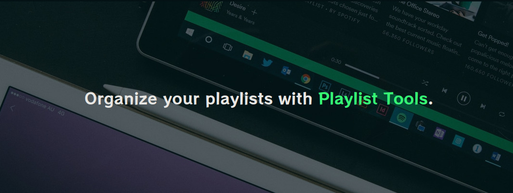

# Playlist Tools 🛠️🎧

## What is Playlist Tools?

Playlist Tools is a website that allows you to organize your playlists with tools.

The following tools are available at this time:

-   Duplicate song remover.
-   Remove tool by filters.
-   Intro remover.
-   Copy tool

## How to build?

If you want to build your own instance of Playlist Tool you need [node](https://nodejs.dev/).

Rename .env.example to .env and provide.

-   Spotify ClientID
-   Redirect url. If you run this project in development mode you can write "localhost:8080"

Run this project with
`npm run serve`
or build it with
`npm run build`.

## Visit Playlist Tools

[Click here](https://jpawlowskii.github.io/Playlist-Tools/)
